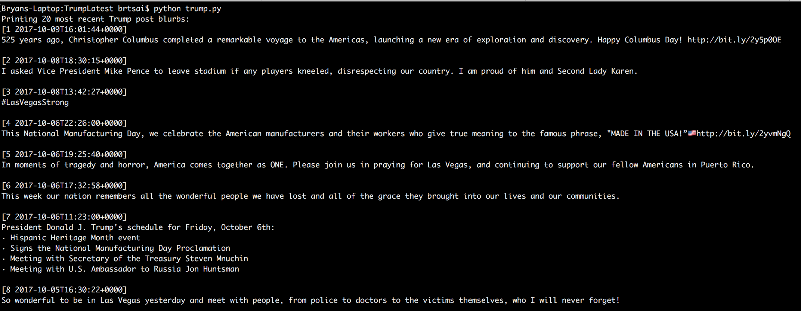

Trump Latest
A program that gives you the 20 latest posts on Donald Trump's facebook page.

Run with the command "python trump.py"

Getting a Facebook Graph Authorisation Token:
    Go to https://developers.facebook.com/tools/explorer/
    Click on "Get Token"
    Choose "Get User Access Token"
    Trump Latest doesn't need any particular permissions, so click on "Get Access Token"
    Copy the Access Token provided by facebook into the first line of AccessToken

